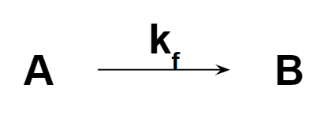
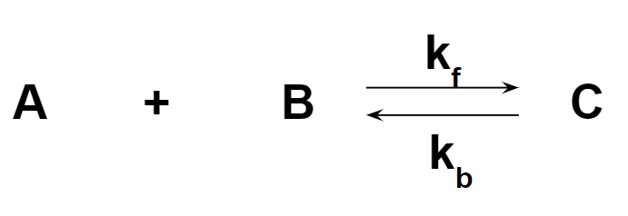

## Math associated with Physiology 

To model cell physiology, it is vital to understand math associated with physiology. 
There is more than one type of physiology taking place in the biological system. 
It can be simple as the first-order chemical reaction, but we expect it to be a multi-step process in most cases. 

Please, look for lecture notes for more details (lecture note will be provided for only students enrolled in [FYRE program](https://www.luc.edu/nsp/first-yearexperience/first-yearresearchexperience/)).
If you are a new member of PKH lab, please visit our wiki page listed on the top tab.  

### Useful links

The following links are useful information regarding fundamentals of our research work.

- [First Order Chemical Reaction in the Rate Law](https://chem.libretexts.org/Bookshelves/General_Chemistry/Map%3A_General_Chemistry_(Petrucci_et_al.)/14%3A_Chemical_Kinetics/14.05%3A_First-Order_Reactions)
- [What is ODE?](https://en.wikipedia.org/wiki/Ordinary_differential_equation)
- [ODE Example in Colab](https://colab.research.google.com/drive/1Nt83GgJBjPTlLaAUN9r0r_Tzas64T1pI?usp=sharing)  

### [Science/Physiology] from the first order chemical reaction to more

You may have heard this term ***first-order*** chemical reaction in General Chemistry course or AP chemistry in highschool. 
Just in case, if not, please click [**here**](https://chem.libretexts.org/Bookshelves/General_Chemistry/Map%3A_General_Chemistry_(Petrucci_et_al.)/14%3A_Chemical_Kinetics/14.05%3A_First-Order_Reactions) and you will find it very useful to understand. 

In English, we describe the first-order chemical reaction as A becomes B. 

In a chemical equation, we write it as:

Then, the corresponding mathematical equation for time-dependent change in concentration A is:

$$
Rate_A = \frac{\Delta A}{\Delta t} = -k_f A
$$

Using this equation, we can figure out the rate of reaction at a given time as long as the concentration of content A is known. 
You probably notice that there is a **negative** sign in front of rate constant, which expresses the consumption of content A as a result of reaction. 
This is very important thing to remember for ***Modeling*** aspect. 

What about slightly more complicated chemical reaction where two chemicals involve?

Because there are two arrows to reactant and product sides, we learn this reaction as a reversible reaction at a forward rate of kf and backward reaction rate of kb.

The corresponding mathematical expression for time-dependent change in each chemical becomes no longer as simple as the first example. 

$$
Rate_A = \frac{\Delta A}{\Delta t} = -k_f A B + k_b C
$$

The real challenge for both occasions is to determine the rate outside of steady-state since it is required to know the concentration of content at a given time, which we usually don't have. 

In most cases, projecting time-dependent concentration change is the primary task of our modeling. 

### [Mathematics] Ordinary Differential Equations 

Although it may take convoluted steps to solve, the ordinary differential equations for the rate of change in each chemical concentration will fulfill our goals. 

The change of concentration A over a given time interval can be re-expressed as dy/dt under the condition of an infinitely small time frame. 

$$
Rate_A = \frac{\Delta A}{\Delta t} \longrightarrow \frac{d A}{d t} = -k_f A B + k_b C
$$

To predict the concentration of a given chemical, we need to understand the boundary condition of this ordinary differential equation, such as the initial value (at t=0) or the steady-state value (usually at t >>>>>>0). 
"Initial" and "steady-state" are somewhat relative terms. The steady-state condition is typically used as our initial input for solving ordinary differential equations. 

Here is an [***example!***](https://colab.research.google.com/drive/1Nt83GgJBjPTlLaAUN9r0r_Tzas64T1pI?usp=sharing)