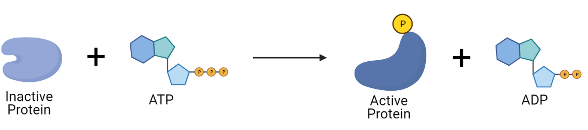
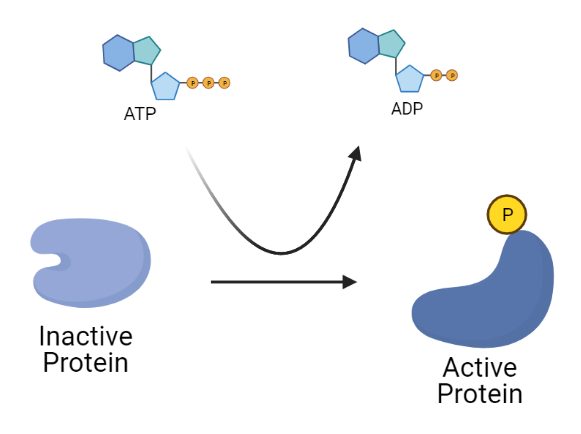
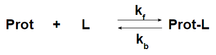
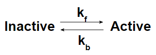

## Physiology and General Chemistry

Then, let's discuss the correlation between physiology/molecular signaling in cell biology and general chemistry that revisit in the previous section. 

The most common signaling, at least, we will deal with in our project is phosphorylation or dephosphorylation. 
It is about whether your enzyme protein either gains or loses a phosphate (functional group) or two of them. 
You may have learned this from biology class, where ATP is used as an energy source by giving off phosphate to proteins. 

- Figure 1: Phosphorylation by ATP

As shown in Figure 1, the phosphorylation by ATP can be expressed as a simple first-order chemical reaction. 
Of course, this is an awful simplification, but it can be a good starting point to model cell signaling. 

### Hill's equation 
There is more than one way to model even simple kinetics. 
We often utilize Hill's equation to describe the kinetics of specific interactions dependent on the product of the preceding reaction. 

For more information regarding Hill's equation in biochemistry, please check out [Wikipedia](https://en.wikipedia.org/wiki/Hill_equation_(biochemistry)#:~:text=The%20Hill%E2%80%93Langmuir%20equation%20is,interaction%20between%20ligand%20binding%20sites.). 

***WARNING***: Application of Hill's equation in this modeling process may not exactly follow the rule in some occasions. 

The original definition of Hill's equation is more like ligand and macromolecule binding, which involves the availability of ligand binding sites on macromolecules. 

This original concept may not be entirely comprehensive for the materials we have studied up to this point. 

Let's redraw Figure 1. 

- Figure 2: Redrawn phophorylation

Rough estimation for "Active Protein" can be a function of "Inactive Protein," "concentration of ATP," or both.

$$
\theta = \frac{1}{1+(\frac{K_A}{[ATP]})^n}
$$
 
- $$\theta$$: fration 
- $$K_A$$: the ligand concentration producting half occupation 
- $$n$$: the Hill cofficient (check out the section explaining Hill coefficient in [Wikipedia](https://en.wikipedia.org/wiki/Hill_equation_(biochemistry)#:~:text=The%20Hill%E2%80%93Langmuir%20equation%20is,interaction%20between%20ligand%20binding%20sites.))

The outcome of this calculation can be used to predict the amount of active protein as the fraction of maximum (generally initial value) or the rate of protein activation or phosphorylation as the fraction of the maximum rate constant. 

For instance,

### Scenario 1: This is enzymic reaction between A and B to produce active C 

- Prot: Receptor
- L: Ligand
- Prot-L: Active Form of Receptor that contains Prot and L 

In Hill's equation, the amount of active receptor can be written as 

$$
C = [Prot]_0 \times \theta 
$$

where,

$$
\theta = \frac{Occupied\; receptor}{Total\; number\;of\;receptor} = \frac{1}{1+(\frac{K_A}{[Prot]_{current}})^n}
$$

The limitation is that the given equation is, we can say, not time-dependent estimation unless you can extract the concentration information at a given time, meaning that it is easy to estimate at steady-state because the final concentration of free receptor/protein is available. 

Therefore, we often explicitly express components involved in the reaction/protein-protein or ligand interaction if necessary to generate 

### Scenario 2: The rate of transition is now a function of a third-party component.  

This is probably the most common case where we often adapt Hill's equation in our model. 

For instance, the ATP-mediated activation of the enzyme leads to another reaction/protein transition known to be a simple first-order reaction.

$$
\frac{K_{current}}{K_{max}} = \frac{1}{1+(\frac{K_A}{[ATP]_{current}})^n}
$$

Instead of using $$k_f$$ as constant value, we are applying Hill's equation to express the transition rate as a function of ATP concentration. 

$$
\frac{d[Active]}{dt} = k_f\times[Inactive] - k_b\times[Active]
$$

where,

$$
k_f = K_{current} = \frac{K_{max}}{1+(\frac{K_A}{[ATP]_{current}})^n}
$$

If ATP is another time-dependent dependent variable, you simply have to express the change in ATP concentration using another differential equation. 
For instance:

$$
\frac{d[ATP]}{dt} = -k_{degradation}\times[ATP]
$$

By solving all these three equations simultaneously, you should be able to project the time-dependent concentration change of active or inactive protein. 

Here is an [***exercise***](https://colab.research.google.com/drive/1bKjaiIDZ4GXl-IdiHowNjv-qCmjIa-nZ?usp=sharing)!!
