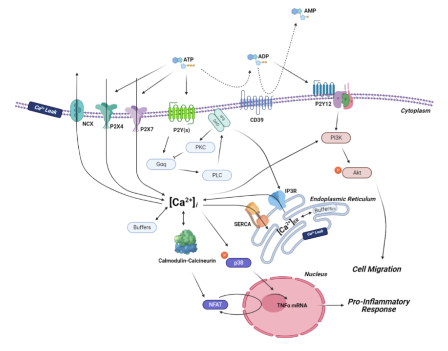

## What is the main goal of our research? 

This branch of our research group has focused on modeling the physiology in cardiomyocytes, microglia, and macrophages. 

### Cardiac Research 

- Figure 1: from physiology to mechanical properties of cardiac myocytes and sacromeres ([Source](https://www.cvphysiology.com/Cardiac%20Function/CF020#:~:text=The%20cardiac%20myocyte%20is%20a,contain%20myofilaments%20(Figure%201).))

For instance, the heartbeat we refer to in real life is the combination of thousands of chemical reactions or interactions among proteins in muscle tissue. 
The dysfunctional physiology in this cardiac muscle can cause a severe problem, leading to arrhythmia or cardiac arrest. You name it. 
Having a blueprint of physiology for this muscle tissue or cell, the scientists can identify the source of the problem that may not be detectable in the outcome via a computational method, which correlates system biology based on physiology to mechanical transformation of muscle tissue ([Read mechano-electric coupling example](https://journals.physiology.org/doi/full/10.1152/physrev.00036.2019)). 
The most practical application of our method would be identifying the drug target. To fix the problem causing a severe issue, we can improve by enhancing or suppressing preceding or after that pathways (sometimes, a direct approach would work as well). 
For more detail, please [check out](https://www.sciencedirect.com/science/article/pii/S0143416017301537) one of our computational works.

### Modeling Immune Response of Microglia/Macrophage

- Figure 2: from cell biology to immune activity of microglia/macrophages

Microglia/macrophages are critical immune cells in our body. Our microglia research is based on how they respond to the broad range of damage, including physical injury or damage by disease (pathogen-associated molecular patterns, PAMPs, or damage-associated molecular patterns, DAMPs). 
Due to their roles as neuron protector/maintenance specialists, it is substantially vital to detect any abnormal chemical balance of their surroundings so that the traffic of neurotransmitters is smooth. 
However, they may not work as well as we expect. 
For instance, microglia reside in the central nervous system, especially the brain ([Bible of Microglial Physiology](https://journals.physiology.org/doi/full/10.1152/physrev.00011.2010?rfr_dat=cr_pub++0pubmed&url_ver=Z39.88-2003&rfr_id=ori%3Arid%3Acrossref.org)). 
Many researchers have lately paid great attention to microglial physiology to solve the puzzle of neurodegenerative diseases, such as Alzheimer's disease or Parkinson's disease. 
Neuroscientists do believe that the cells are capable of both repairing and damaging the neuronal network. 
However, we are not even close to the answer to this mystery. 

Our approach for this topic is very similar to understanding macrophages' role in tumor/cancer research ([Fun to read about macrophages](https://www.ncbi.nlm.nih.gov/pmc/articles/PMC5362657/#:~:text=Macrophage%20heterogeneity%20under%20physiological%20conditions&text=Macrophages%2C%20unlike%20neutrophils%2C%20are%20integral,detect%20pathogens%20and%20trigger%20inflammation.)). 
A number of researchers, particularly computational physiology associated, have exerted tremendously to understand the mechanism of their immune responses and how they transform themselves from protective immune cells to harmful/destructive cells. 
The recent achievement is that there is critical physiology governing the state of cells. 
It would lead to what type of treatment would be most effective, the opportunity to develop the site-specific drug, and the rest of the story would be a happy ending. 

In this tutorial, we are providing a stepstone of this work. In the end, you become a prominent scientist for drug development!

